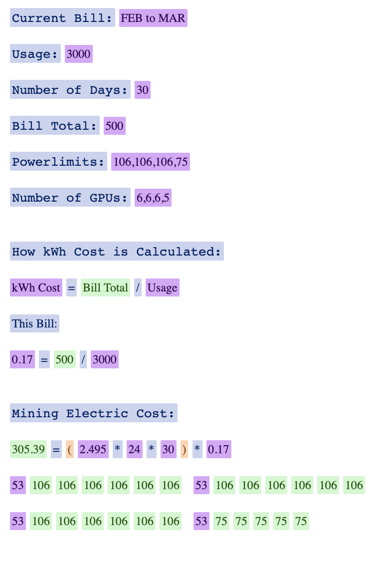

# electric cost calculator

Estimate your mining electric cost using details from your electric bill and rigs.

---

# 

Uses jquery 3.4.0.

---

Click on the purple buttons to make them editable:

Click away to implement your edits.

---

- Current Bill: (`use any title you wish`)

- Usage: (`get this number from your electric bill`)

- Number of Days: (`get this number from your electric bill or use the desired number`)

- Bill Total: (`get this number from your electric bill`)

- Powerlimits: (`enter each rigs powerlimit comma separated with no spaces`)

- Number of GPUs: (`enter the number of GPUs for each rig comma separated with no spaces`)
